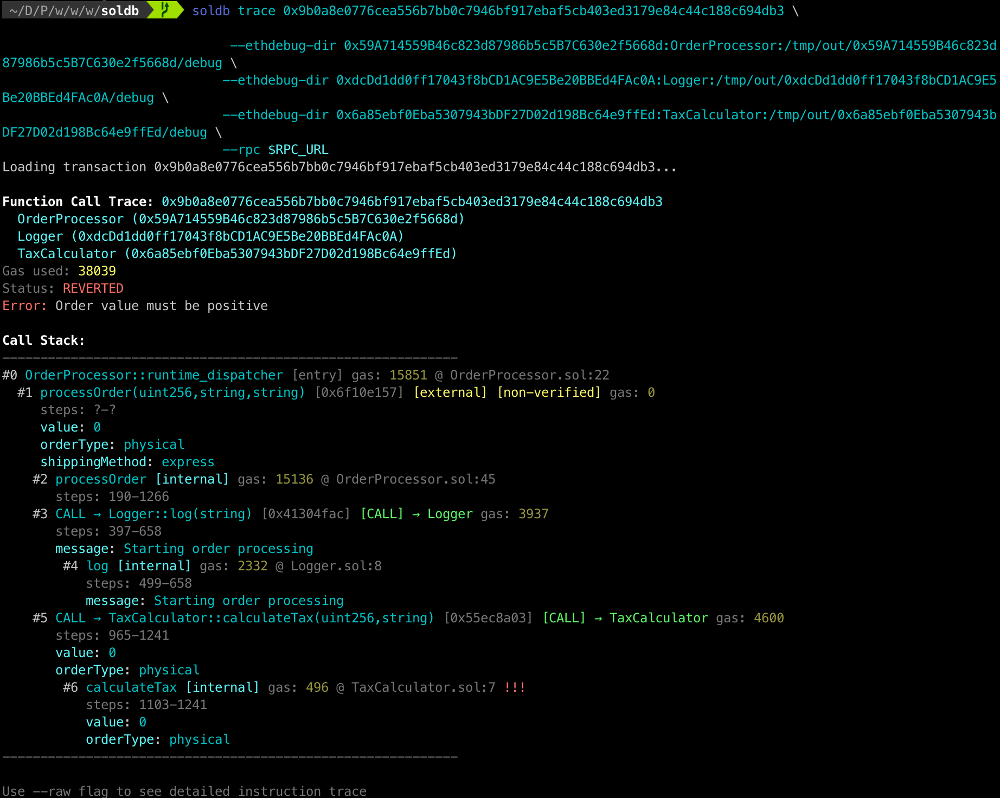

> ⚠️ SolDB is currently in **public beta** – not yet recommended for production use. Expect bugs, missing features, and breaking changes.

# SolDB EVM Debugger

A CLI debugger for the EVM and Solidity.



## Features

1. Full transaction traces with internal calls
2. Decoded arguments and results
3. Transaction simulation
4. Suport for custom RPC including local node (Anvil) or hosted

## Table of Contents

- [Installation](#installation)
- [Usage](#usage)
  - [Get a Full Trace of a Transaction](#get-a-full-trace-of-a-transaction)
  - [Get a Full Trace of a Transaction Simulation](#get-a-full-trace-of-a-transaction-simulation)
  - [Interactive Debugger for a Transaction](#interactive-debugger-for-a-transaction)
  - [Interactive Debugger for a Transaction Simulation](#interactive-debugger-for-a-transaction-simulation)
  - [Interactive Debugger for a Solidity Project](#interactive-debugger-for-a-solidity-project)
- [Advanced](#advanced)
  - [Install From Source](#install-from-source)
  - [Run Automated Tests](#run-automated-tests)
- [License](#license)

## Installation

Before installing, ensure you have the following requirements:

- **Python 3.7+** - For SolDB
- **Foundry** - For contract development and Anvil node
- **Solidity compiler** - Version 0.8.29+ with ETHDebug support

**Install SolDB:**
```bash
pip install git+https://github.com/walnuthq/soldb.git
```

## Usage

> **NOTE**: SolDB is primarily intended for local debugging. While Anvil (local node) is recommended for development, SolDB supports any RPC endpoint. The examples below use `http://localhost:8545` (Anvil's default).

<details>
  <summary><strong>Prerequisites (expand if needed)</strong></summary>

  **Run Anvil with tracing enabled**

  Ensure your node has tracing enabled, which is required by the debugger to function correctly.

  ```bash
  anvil --steps-tracing
  ```

  **Compile with ETHDebug**

  SolDB relies on the standard [ETHDebug format](https://ethdebug.github.io/format/spec/overview) from the Solidity compiler (requires Solidity 0.8.29+):

  ```bash
  solc --via-ir --debug-info ethdebug --ethdebug --ethdebug-runtime \
       --bin --abi --overwrite -o /tmp/ethdebug-output examples/Counter.sol
  ```

  This will:
  - Compile contract with ETHDebug support: `solc --via-ir --debug-info ethdebug --ethdebug --ethdebug-runtime`
  - Save ETHDebug JSON files to `/tmp/ethdebug-output`

</details>

### Get a Full Trace of a Transaction

```bash
soldb trace <tx_hash> --ethdebug-dir /tmp/ethdebug-output/ --rpc http://localhost:8545
```

Where `/tmp/ethdebug-output` contains debug information for contracts inside of the transaction.

Example output:

```
Function Call Trace: 0x2832a995d3e50c85599e7aa0343e93aa77460d6069466be4b81dbc1ea21a3994
Contract: TestContract
Gas used: 50835
Status: SUCCESS

Call Stack:
------------------------------------------------------------
#0 TestContract::runtime_dispatcher [entry] gas: 29631 @ TestContract.sol:1
  #1 increment [0x7cf5dab0] [external] gas: 29241 @ TestContract.sol:23
     steps: 99-966
     amount: 23
    #2 increment2 [internal] gas: 6322 @ TestContract.sol:39
       steps: 296-966
       amount: 23
      #3 increment3 [internal] gas: 5172 @ TestContract.sol:54
         steps: 529-966
         amount: 0
------------------------------------------------------------

Use --raw flag to see detailed instruction trace
```

### Get a Full Trace of a Transaction Simulation

Test contract functions without sending transactions on chain.

```bash
# Simple function call
soldb simulate <contract_address> "increment(uint256)" 10 \
    --from <sender_address> \
    --ethdebug-dir /tmp/ethdebug-output \
    --rpc http://localhost:8545

# Function with struct arguments
soldb simulate <contract_address> "submitPerson((string,uint256))" '("Alice", 30)' \
    --ethdebug-dir /tmp/ethdebug-output \
    --from <sender_address> \
    --rpc http://localhost:8545

# Nested struct/tuple argument
soldb simulate \
  <contract_address> \
  "submitCompany((string,(string,uint256)))" \
  '("Acme Corp", ("Bob", 42))' \
  --ethdebug-dir /tmp/ethdebug-output \
  --rpc http://localhost:8545

# Raw data
soldb simulate --raw-data \
0x785bd74f000000000000000000000000000000000000000000000000000000000000002000000000000000000000000000000000000000000000000000000000000000400000000000000000000000000000000000000000000000000000000000000080000000000000000000000000000000000000000000000000000000000000000941636d6520436f727000000000000000000000000000000000000000000000000000000000000000000000000000000000000000000000000000000000000040000000000000000000000000000000000000000000000000000000000000002a0000000000000000000000000000000000000000000000000000000000000003426f620000000000000000000000000000000000000000000000000000000000 \
  <contract_address> \
  --ethdebug-dir /tmp/ethdebug-output \
  --from <sender_address> \
  --rpc http://localhost:8545 
```

Example output:
```
TBD - maybe use failed simulation output
```

### Interactive Debugger for a Transaction

Start an interactive REPL to step through a transaction at source or instruction level, set breakpoints, inspect variables, and more.

```bash
soldb trace <tx_hash> \
  --ethdebug-dir /tmp/ethdebug-output \
  --rpc http://localhost:8545 \
  --interactive
```

Common commands inside the debugger: `next`, `nexti`, `continue`, `break <pc>`, `where`, `vars`, `print <expr>`.

### Interactive Debugger for a Transaction Simulation

TBD

### Interactive Debugger for a Solidity Project
Debug a Solidity project
```bash
# Debug deployed contract
soldb debug --contract-address <contract-address>
--function getCount
--ethdebug-dir /debug/ethdebug/

# Compile and deploy a contract to debug it
soldb debug --contract-file Counter.sol
--function getCount
--output-dir /debug/ethdebug/
```
Where `/debug/ethdebug` contains debug information.

Example output:
```
Starting debugger...
Loaded 1363 PC mappings from ethdebug
Contract: Counter
Environment: runtime
Loaded source: Counter.sol
Contract loaded: 0xb3DA7a34921a292b30A903dE88ad5b74b760F345
[SNAPSHOT] Created snapshot 0x7e
Simulating getCount()...
Simulation complete. 1944 steps.

SolDB EVM Debugger - Solidity Debugger
Type help for commands. Use next/nexti to step, continue to run, where to see call stack.


Counter.sol:4 in getCount()
=> contract Counter {
[ Step 0 | Gas: 44891048 | PC:    0 | PUSH1 ]
```

## Advanced

### Install From Source

For development or contributing to SolDB:

1. **Clone the repository:**
   ```bash
   git clone https://github.com/walnuthq/soldb.git
   cd soldb
   ```
2. **Set up a Python virtual environment:**
   ```bash
   python3 -m venv MyEnv
   source MyEnv/bin/activate
   ```

3. **Install Python dependencies:**
   ```bash
   pip install -r requirements.txt
   ```

4. **Install SolDB in editable mode:**
   ```bash
   pip install -e .
   ```

### Run Automated Tests

**Prerequisites**

Tests expect RPC at `http://localhost:8545` (Anvil default) and use Anvil's test account private key. Also, it uses LLVM's `lit` and `FileCheck` tools, so before running tests, you need to install LLVM tools:

```bash
# macOS
brew install llvm

# Ubuntu
sudo apt-get install llvm-dev
```

**Running Tests**

```bash
cd test
./run-tests.sh SOLC_PATH=/path/to/solc
```

**NOTE**: Make sure Anvil is running with tracing enabled before running tests:
```bash
anvil --steps-tracing
```

## License

SolDB is licensed under the GNU General Public License v3.0 (GPL-3.0), the same license used by Solidity and other Ethereum Foundation projects.

📄 [Full license text](./LICENSE.md)  
📬 Contact: hi@walnut.dev
